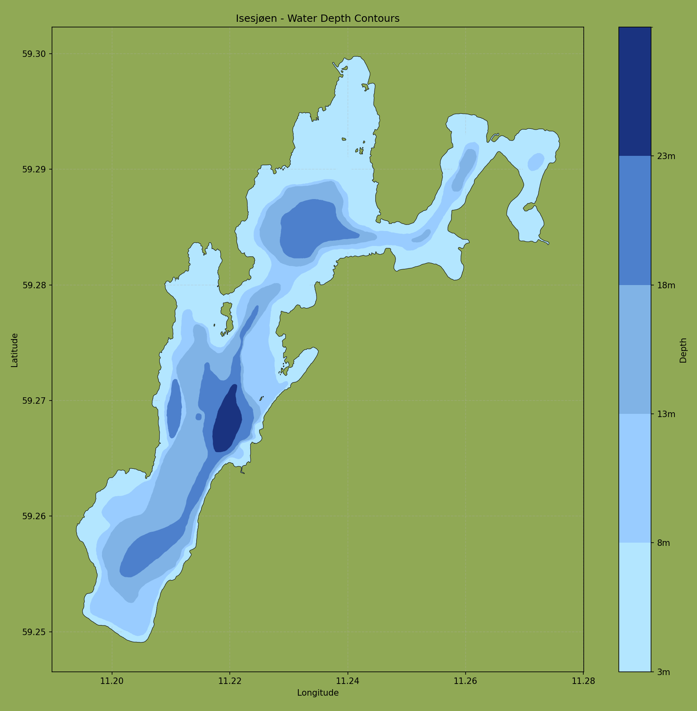

# Isesjøen Depth Map

An interactive visualization tool for displaying the depth contours of Isesjøen lake and marking fishing spots.



## Map Visualization
The map shows:
- Depth contours in shades of blue (lighter = shallower, darker = deeper)
- Land areas in forest green
- Fishing spots marked with red dots and labels
- Depth scale in meters
- Interactive features like zoom and pan

## Features
- Displays depth contours with a color-coded visualization
- Allows marking and labeling of fishing spots
- Interactive map with zoom and pan capabilities
- Easy-to-use coordinate input system

## Prerequisites
- Python 3.8 or higher
- pip (Python package installer)

## Installation

1. Clone this repository:
```bash
git clone https://github.com/Johannes-T-E/Isesjoen-gps-fiskeplot
cd Isesjoen-gps-fiskeplot
```

2. Create and activate a virtual environment (recommended):
```bash
# Windows
python -m venv venv
venv\Scripts\activate

# Linux/Mac
python3 -m venv venv
source venv/bin/activate
```

3. Install required packages:
```bash
pip install -r requirements.txt
```

## Usage

### Running the Map
1. Run the main script:
```bash
python main.py
```

### Adding Fishing Spots
1. Open `coordinates.txt`
2. Add your fishing spots in the following format:
```
LocationName: DD°MM'SS.S"N DD°MM'SS.S"E
```
Example:
```
Fisk1: 59°16'57.8"N 11°14'10.7"E
Fisk2: 59°16'55.2"N 11°15'31.8"E
Fisk3: 59°17'12.5"N 11°15'22.1"E
Fisk4: 59°17'05.9"N 11°14'45.3"E
Fisk5: 59°17'18.7"N 11°14'26.9"E
Fisk6: 59°16'65.4"N 11°15'18.2"E
Fisk7: 59°17'25.1"N 11°14'35.4"E
```

## File Structure
- `main.py` - Main script for generating the map
- `coordinates.txt` - File for storing fishing spot coordinates
- `isesjo_kart.geojson` - GeoJSON file containing lake depth data
- `requirements.txt` - List of Python package dependencies

## Notes
- The map uses a color gradient to represent different depths
- Fishing spots are marked with red dots and labeled
- Labels maintain consistent positioning during zoom/pan operations

## Contributing
Feel free to submit issues and enhancement requests! 